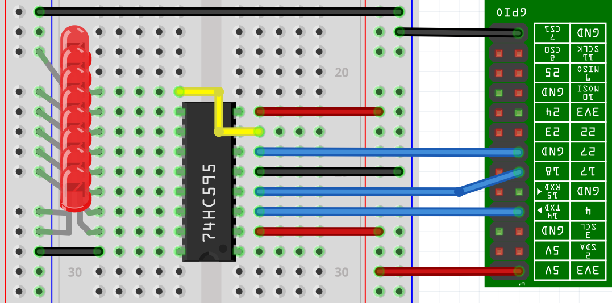

GPIOShifRegister
================

GPIOShiftRegister is an Haskell library showing how to handle a Shift Register
chipset 74HC595 on a Raspberry Pi.

It requires the HPi package which in turns requires the BCM2835 library by Mike
McCauley. The HPi package was chosen because it works on Raspberry Pi 1 with as
low version as GHC 7.6.

An example is given in the example directory with an image of how to wire a
74HC595 chipset on a breadboard.

